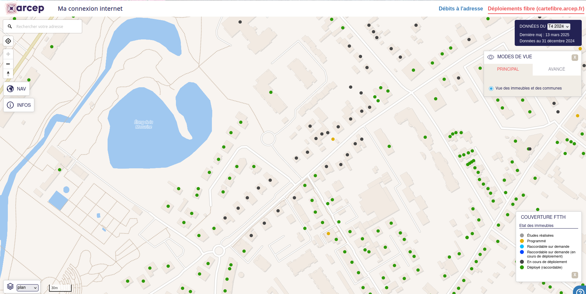

# 🌐 Site Enquêt Raynal Fibre

Bienvenue sur ce site personnel hébergé via **GitHub Pages**. Juste pour proposer un formulaire enquête sur la fibre.

---

## 📝 À propos

Petit questionnaire afin de transmettre des éléments concrets et une remontée en temps réels du terrain, auprès de la mairie et de notre maire de quartier. 

L'idée est de formuler un mail à la mairie pour tenter d'avoir un impact.

Imaginé à la base pour le cas particulier du chemin Raynal à Croix Daurade et parce que la fibre y est déployée depuis plus de 5 ans dans certaines rues, ce formulaire peut-être communiqué plus largement.

Totalement anonyme, je vous propose de laisser un contact mail pour être tenu informé des suites données à cette enquête (résultat enquête, copie du mail adressé à la mairie et la suite des échanges). 

---

## 🖼️ Carte de l'arcep

[Site de l'arcep]( https://cartefibre.arcep.fr/)

---

## 📬 Formulaire

Merci de remplir ce formulaire pour participer à l'enquête :

👉 [Remplir le formulaire](https://forms.gle/HiZzt7n69iw4xakx9)

> Le formulaire est aussi intégré directement sur la page d’accueil via une balise `<iframe>`.

---

## 🚀 Déploiement

Ce site est hébergé avec **GitHub Pages** :

- 🔗 URL : `https://petitmillefa.github.io/mon-site/`
- 📁 Source : branche `main`, dossier racine

---

##
